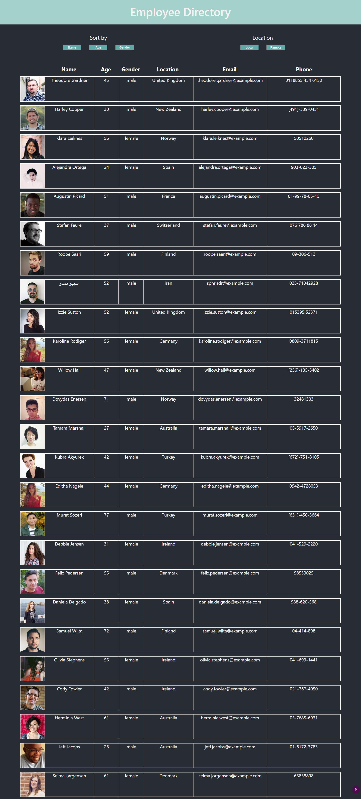

# React Empoloyee Directory
## Description 

The purpose of this project is to create an Employee Directory using react components. The application must also manage component state and respond to user events

The webpage is hosted on [GitHub](https://rconat.github.io/react-employee-directory/).

You can find the repo on [GitHub](https://github.com/Rconat/react-employee-directory).

## Table of Contents

* [Installation](#Installation)
* [List of Files](#List-of-Files)
* [React JavaScript Library](#React-JavaScript-Library)
* [Random User Generator API](#Random-User-Generator-API)
* [List of Files](#List-of-Files)
* [Usage](#Usage)
* [Credits](#Credits)

## Installation

This application requires axios and styled-components. Install all of the required packages using the following code:

    npm install

## List of Files

<ul>
    <li>index.html</li>
    <li>favicon.ico</li>
    <li>manifest.json</li>
    <li>Employees.js</li>
    <li>Filter.js</li>
    <li>Grid.js</li>
    <li>GridHeader.js</li>
    <li>Header.js</li>
    <li>Sort.js</li>
    <li>App.css</li>
    <li>App.js</li>
    <li>App.test.js</li>
    <li>index.css</li>
    <li>index.js</li>
    <li>reportWebVitals.js</li>
    <li>setupTests.js</li>
    <li>.gitignore</li>
    <li>package-lock.json</li>
    <li>package.json</li>
    <li>README.md</li>
    <li>main.png</li>
</ul>

## React JavaScript Library

React is a JavaScript library used primarily for building user interfaces. React is component based meaning that the application is broken down into multiple components which are the updated using the component state. This allows for the application to refresh small sections rather than updating the entire application when re-rending information. This provides a smoother user experience. For more information visit the [React documentation](https://reactjs.org/).

## Random User Generator API

This application uses the Random User API. This API allows us to generate random use information which will be used throughout the Employee Directory Application. The data exists in an object which is obtained through a get call using axios. For more information about this api visit the [Random User API Documentation](https://randomuser.me/).

## Usage 

This application is available to any user who wishes to make an Employee Directory for their own company. Since they application uses fake data with the Random User API, it does not have any use outside of giving a basic structure and layout as well as functionality that someone may want to impliment into their own Employee Directory. Instead of calling out to the Random User API, they would be able to do a call to a database of employees on a company server but keep the same functionality for an easy repurpose of the source code. The functionality included in this application is to sort by name, age, or gender as well as filtering by local employees (employees whose location is in the United States) or remote employees (anyone outside of the United States).

## Credits

Working alongside professors and TAs through Trinity and Northwestern Coding Bootcamp to provide the assignment parameters for this applicaiton.

---

